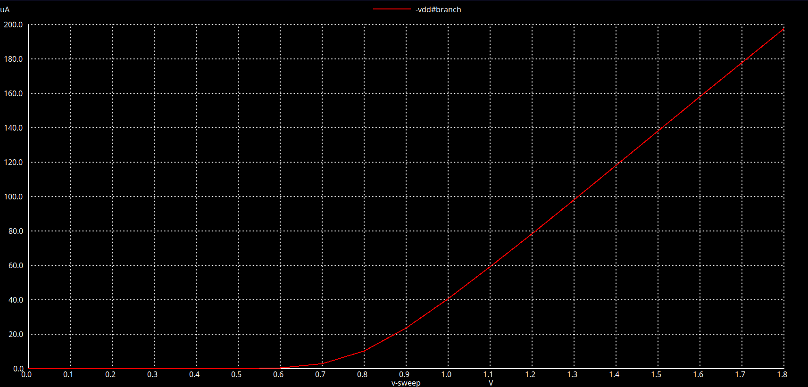
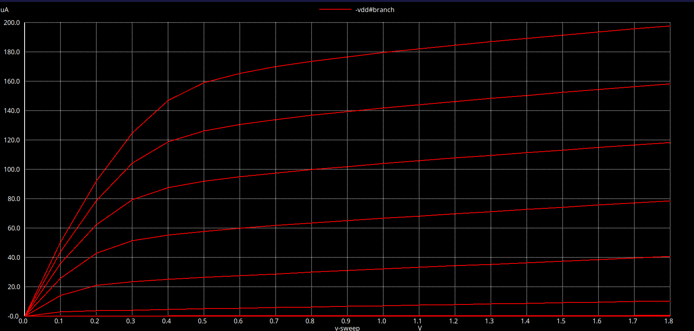
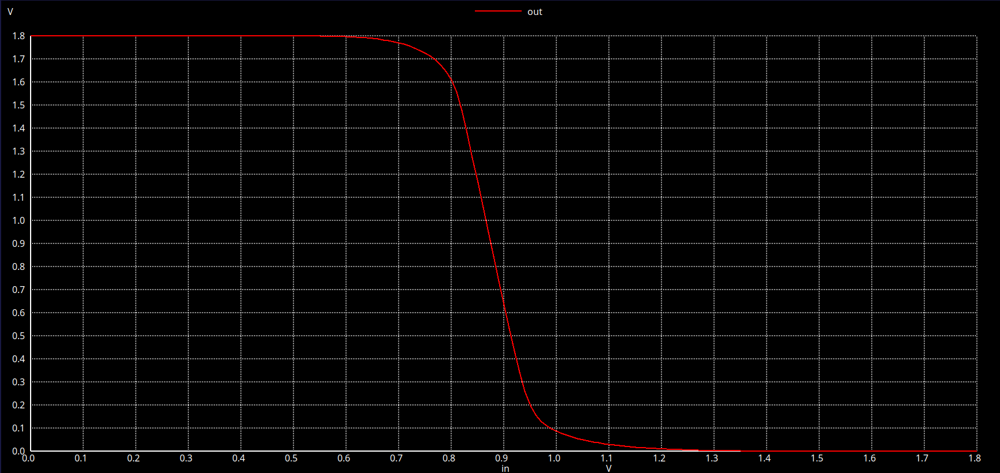
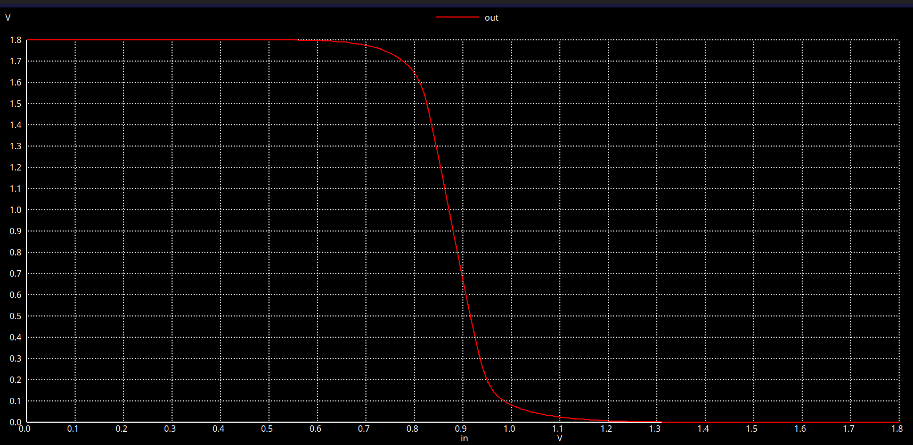
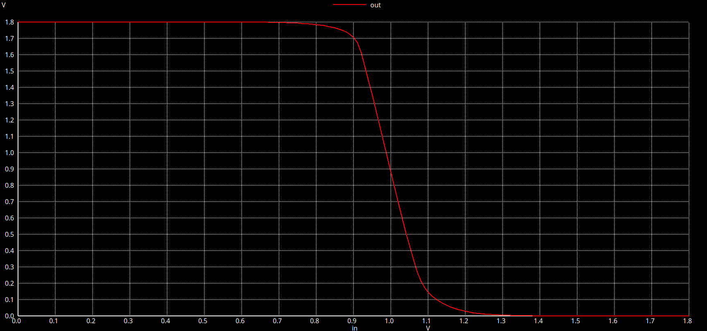
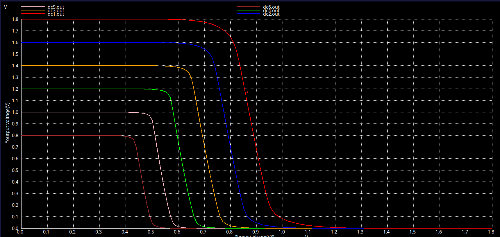

# 🌸📖 Silicon Saga__Chapter 4 (Week 4) 🌸
## CMOS Circuit Design (sky130-style)

This week’s exercise focuses on **analog circuit simulation** using **Ngspice** integrated with the **Sky130 PDK**.  
You will simulate and analyze the electrical behavior of devices such as **NMOS**, **PMOS**, and **CMOS inverters**, while exploring how device dimensions and process variations influence circuit performance.

---

# ⚡What is Circuit Design?
 Gates made up of pmos and nmos transistors arranged in a particualr fashion and perform required functionality...

 # 🎯Why SPICE ?
 To find output characterstics we need to do simulation and also it help in calculation delay which furthermore give information about W/L ratios. To change delay we need to change W/L ratio and that can only be obtained by SPICE simulation...

 ## Installation of ngSpice
  
  ngspice is a open source simulator used for circuits..

  ```
  sudo apt update
  sudo apt upgrade
  sudo apt install ngspice -y
  ngspice -v

  ```
  
  ---
## How to write ngspice code?

# ⚙️ Step 1: Identify Circuit Components

Before creating the simulation file, clearly identify all elements in your design.

| Component Type | Symbol | Description |
|----------------|---------|-------------|
| Voltage Source | `VDD`, `Vin` | Power supply and input signal |
| NMOS Transistor | `M1` | Acts as a pull-down network |
| PMOS Transistor | `M2` | Acts as a pull-up network |
| Capacitor | `Cload` | Models output loading effect |

🧩 **Example — CMOS Inverter Nodes**
VDD, Vin, out, NMOS, PMOS

---
# 📝 Step 2: Create the Netlist File

Ngspice reads circuit descriptions written in **SPICE netlist format**.

1. Open a text editor (e.g., VS Code, nano).
2. Write your circuit description.
3. Save the file with a `.spice` or `.cir` extension (e.g., `inverter.spice`).

---

# 🔌 Step 3: Define Voltage Sources

```spice
VDD Vdd 0 DC 5
Vin in 0 PULSE(0 5 0 1n 1n 10n 20n)
```

| Source  | Node Connections | Function                               |
| ------- | ---------------- | -------------------------------------- |
| **VDD** | Vdd → 0          | Constant DC supply (5 V)               |
| **Vin** | in → 0           | Pulse signal for switching (0 V → 5 V) |

---
# Step 4: Define Devices and Load

```
M1 out in 0 0 NMOS L=1u W=10u
M2 out in Vdd Vdd PMOS L=1u W=20u
Cload out 0 1p

```
| Device    | Description     | Terminals                 | Parameters      |
| --------- | --------------- | ------------------------- | --------------- |
| **M1**    | NMOS transistor | D=out, G=in, S=0, B=0     | L=1 µm, W=10 µm |
| **M2**    | PMOS transistor | D=out, G=in, S=Vdd, B=Vdd | L=1 µm, W=20 µm |
| **Cload** | Load capacitor  | out → 0                   | 1 pF            |

💡 Adjust L (length) and W (width) to explore device scaling effects.

---

# 🧠 Step 5: Add Control Commands
```
.control
run
plot v(in) v(out)
.endc
```
| Command             | Purpose                             |
| ------------------- | ----------------------------------- |
| `.control`          | Begins the simulation control block |
| `run`               | Executes the defined analysis       |
| `plot v(in) v(out)` | Displays the input–output waveforms |
| `.endc`             | Ends the control block              |

---

# ▶️ Step 6: Run the Simulation

Save the file as inverter.spice..Open the terminal and run

```
ngspice inverter.spice
```
---

# 📊 Step 7: Analyze Results

| Observation            | Expected Behavior                                     |
| ---------------------- | ----------------------------------------------------- |
| Input–Output Waveforms | Complementary switching (logic inversion)             |
| Transition Delay       | Affected by transistor size and load capacitance      |
| Supply Sensitivity     | Varying `VDD` changes switching threshold             |
| Robustness             | Check performance across process corners (TT, FF, SS) |

---


# ⚡ Task 1 – NMOS Id–Vds Characteristics

## 🎯 Objective
To simulate and analyze the **Id–Vds characteristics of an NMOS transistor** using the **SkyWater 130nm PDK** in **Ngspice**.  
This experiment builds a foundation for understanding how MOSFETs behave across different operating regions — knowledge essential for both **analog design** and **digital CMOS circuits**.

---

## 🧠 Why It Matters
MOSFETs are the fundamental building blocks of all modern chips.  
The **Id–Vds curve** reveals how current responds to applied voltages — the same principle that governs switching speed, power consumption, and gain in integrated circuits.  
Understanding this curve means understanding how transistors *think*.

---
## 🔌 Circuit Description
```
         Vds (sweep)
            │
            ▼
         [Drain]
            │
    Vgs ──>[Gate]
            │
         [Source]
            │
           GND
```

| **Node**   | **Description**                  |
| ------ | ----------------------------- |
| *Drain*  | Voltage sweep node (Vds)      |
| *Gate*   | Stepped control voltage (Vgs) |
| *Source* | Ground reference              |
| *Body*   | Tied to source (no body bias) |

---

# SPICE NETLIST

```
* NMOS Id-Vds Characteristics
* Device: W=5µm, L=2µm

.lib "/home/neharika/sky130CircuitDesignWorkshop/design/sky130_fd_pr/models/sky130.lib.spice" tt

* Our transistor 
XM1 vdd n1 0 0 sky130_fd_pr__nfet_01v8 w=5 l=2

* Power supply
Vdd vdd 0 1.8

* Gate voltage
Vin in 0 1.8

* Sweep Vds from 0→1.8V, Vgs in steps of 0.2V
.dc Vdd 0 1.8 0.1 Vin 0 1.8 0.2

.end

```
---
## 🚀 Running the Simulation

Save the file as nmos_idvds.spice
Run the simulation:

```ngspice nmos_idvds.spice
```
**Inside Ngspice, plot the drain current:**

```
plot -i(Vds)

```
🧩 The negative sign is required because ngspice defines current direction as flowing into the voltage source.

---

## 📈 Understanding the Results

| **Observation**                           | **Interpretation**                             | **Design** **Insight**                           |
| --------------------------------------- | ------------------------------------------ | ---------------------------------------- |
| **Steep initial slope**                 | Low channel resistance in linear region    | Excellent for switches                   |
| **Saturation plateau**                  | Current stabilizes with Vds                | Ideal for amplifiers and current mirrors |
| **Increasing Vgs shifts curves upward** | Stronger channel conduction                | Higher drive strength and speed          |
| **Distinct curves for each Vgs**        | Voltage-controlled current source behavior | Core concept for analog design           |

---


---

## Key Takeaways

**"Every digital gate is just MOSFETs playing tug-of-war with electrons"**

---

# 🎯 Task 2 — Threshold Voltage & Velocity Saturation

## 🎯 Objective
To determine the **threshold voltage (Vt)** of an NMOS transistor and understand **velocity saturation** effects in short-channel devices using the **SkyWater 130nm PDK**.

---
## 🧩 Key Concepts

| Concept | Description |
|----------|--------------|
| **Threshold Voltage (Vt)** | The gate voltage where the MOSFET starts conducting |
| **Velocity Saturation** | Condition when carrier velocity stops increasing despite higher fields |
| **CMOS Relevance** | Defines inverter switching point and speed-power trade-offs |

---
## 🧱 Device Specifications

| Parameter | Value | Purpose |
|------------|--------|----------|
| Width (W) | 1.8 µm | Sets current capability |
| Length (L) | 1.2 µm | Controls speed vs. current |
| W/L Ratio | 1.5 | Defines transistor strength |

> **Note:** Higher W/L ratios yield stronger drive but increase capacitance and area.

---

| **Region** | **Condition** | **Behavior** |
|--------|------------|-----------|
| **Linear** | Vds < (Vgs − Vt) | Acts as voltage-controlled resistor |
| **Saturation** | Vds ≥ (Vgs − Vt) | Current nearly constant; channel pinched off |

---

## ⚡ Velocity Saturation — Short Channel Effect

In transistors with **L < 250 nm**, carriers reach a **maximum velocity (≈10⁷ cm/s)**, causing current to increase linearly with (Vgs − Vt), not quadratically.

| Feature | Long Channel | Short Channel |
|----------|---------------|----------------|
| Mode | Cutoff, Linear, Saturation | + Velocity Saturation |
| Current Relation | Id ∝ (Vgs − Vt)² | Id ∝ (Vgs − Vt) |
| Max Current | Higher (~410 µA) | Lower (~210 µA) |
| Speed | Moderate | Very High |
| Trade-off | More current, slower | Less current, faster |

**Equation:**
Id = W · Cox · vsat · (Vgs − Vt)

---
## Velocity Saturation and Basics of CMOS Inverter VTC

```
* Short-channel NMOS Id-Vds characteristics
.param temp=27
.lib "/home/neharika/sky130CircuitDesignWorkshop/design/sky130_fd_pr/models/sky130.lib.spice" tt

* Device: W=0.39µm, L=0.15µm (short channel!)
XM1 Vdd n1 0 0 sky130_fd_pr__nfet_01v8 w=0.39 l=0.15

* Series resistor for current measurement
R1 n1 in 55

* Supply voltages
Vdd vdd 0 1.8V
Vin in 0 1.8V

* Sweep Vds and Vgs
.dc Vdd 0 1.8 0.1 Vin 0 1.8 0.2

.control
run
display
setplot dc1
.endc

.end

```



---

```
* NMOS transfer characteristic (Id vs Vgs)
.param temp=27
.lib "/home/neharika/sky130CircuitDesignWorkshop/design/sky130_fd_pr/models/sky130.lib.spice" tt

XM1 Vdd n1 0 0 sky130_fd_pr__nfet_01v8 w=0.39 l=0.15
R1 n1 in 55

Vdd vdd 0 1.8V
Vin in 0 1.8V

* Sweep gate voltage
.dc Vin 0 1.8 0.1

.control
run
display
setplot dc1
.endc

.end

```


---

# Task3 — CMOS Switching Threshold and Dynamic Simulations

*Tracing how a tiny voltage decides between logic ‘0’ and ‘1’.*

## 🎯 Objective

To simulate and understand the **Voltage Transfer Characteristic (VTC)** of a CMOS inverter using the **SkyWater 130 nm PDK**, and determine the **switching threshold voltage (Vm)** — the critical point where both transistors share equal responsibility.

---
## 🧩 What Is the VTC?

The **VTC** curve shows how an inverter’s output responds to different input levels.  
As the input sweeps from 0 V to VDD:

- The **PMOS** gradually turns off.  
- The **NMOS** begins to conduct.  
- At one precise input level (**Vm**), both transistors conduct equally — the inverter flips.

This point defines logic balance and affects speed, power, and noise immunity.

---

## ⚙️ Circuit Design

### Basic Configuration

| 
*Device* | *Type* | *W (µm)* | *L (µm)* | *Notes* |
|:--------|:------|:------:|:------:|:------|
| M1 | PMOS | 0.84 | 0.15 | Wider to offset lower hole mobility |
| M2 | NMOS | 0.36 | 0.15 | Standard minimum geometry |
| — | Cload | 50 fF | — | Simulated fan-out load |
| — | VDD | 1.8 V | — | Sky130 nominal supply |

### Design Insight
Electrons travel faster than holes (**μn ≈ 2.5 μp**).  
To make both devices switch symmetrically:
Wp / Wn ≈ μn / μp ≈ 2.3

Our ratio of **0.84 / 0.36 ≈ 2.33** achieves a nearly centered Vm close to VDD/2.

---

## 🧠 Operation Summary

| Input Voltage | PMOS | NMOS | Output | Region |
|:---------------|:------|:------|:---------|:-----------|
| 0 → 0.4 V | ON | OFF | ≈ VDD | High level |
| 0.4 → 1.4 V | Partially ON | Partially ON | Rapid drop | Transition |
| 1.4 → 1.8 V | OFF | ON | ≈ 0 V | Low level |

At **Vm**, both transistors are in **saturation**, producing the steepest slope on the curve.

---

## 🧾 SPICE Setup


```

.param temp=27
.lib "/home/neharika/sky130CircuitDesignWorkshop/design/sky130_fd_pr/models/sky130.lib.spice" tt


* Devices
XM1 out in vdd vdd sky130_fd_pr__pfet_01v8 w=0.84u l=0.15u
XM2 out in 0 0 sky130_fd_pr__nfet_01v8 w=0.36u l=0.15u

* Load and sources
Cload out 0 50f
Vdd vdd 0 1.8
Vin in 0 0

* DC Sweep
.dc Vin 0 1.8 0.01

.control
  run
  plot v(out) vs v(in)
  * Overlay Vin for unity-gain reference
  plot v(out) v(in) vs v(in)
.endc
.end

```

---



---

**Transient Response**

# Inverter Switching Analysis

## Challenge
Move beyond static DC analysis and explore the **real-time switching performance** of the inverter. How fast can it actually change states?

## Objectives
Capture the inverter’s dynamic behavior, including:

- ⏱️ **Rise Time (tr)**: Time for output to transition from LOW → HIGH  
- ⏱️ **Fall Time (tf)**: Time for output to transition from HIGH → LOW  
- ⚡ **Propagation Delays**: Delay between input change and output response  
- 📊 **Transient Behavior**: Any overshoot, undershoot, or glitches during switching

---

## 💻 SPICE


```

.param temp=27
.lib "/home/neharika/sky130CircuitDesignWorkshop/design/sky130_fd_pr/models/sky130.lib.spice" tt

* PMOS (slightly wider for balanced switching)
XM1 out in vdd vdd sky130_fd_pr__pfet_01v8 w=1u l=0.15u

* NMOS (baseline width)
XM2 out in 0 0 sky130_fd_pr__nfet_01v8 w=0.36u l=0.15u

* Output load (typical gate fanout)
Cload out 0 50fF

* Power supply
Vdd vdd 0 1.8V

* Pulse input (1ns edges, 20ns period)
Vin in 0 PULSE(0 1.8 0 1n 1n 10n 20n)

* Transient analysis: 0.1ns steps, 50ns total
.tran 0.1n 50n

* Automated measurements
.measure tran tPLH TRIG v(in) VAL=0.9 TD=0 FALL=1 TARG v(out) VAL=0.9 TD=0 RISE=1
.measure tran tPHL TRIG v(in) VAL=0.9 TD=0 RISE=1 TARG v(out) VAL=0.9 TD=0 FALL=1
.measure tran tRise TRIG v(out) VAL=0.18 RISE=1 TARG v(out) VAL=1.62 RISE=1
.measure tran tFall TRIG v(out) VAL=1.62 FALL=1 TARG v(out) VAL=0.18 FALL=1

* Plotting
.control
run
plot v(in) v(out)
.endc

.end

```
---


---

## 🎓 Key Takeaways

### 💎 Timing Commandments

1. **⚡ Fast Edges Are Good (Usually)**
   - Rise time (tr) and fall time (tf) in the hundreds of picoseconds indicate a healthy design.
   - Be cautious of excessive di/dt, which can introduce noise.

2. **⚖️ Asymmetry is Normal**
   - NMOS devices are naturally faster than PMOS.
   - You can balance speeds by oversizing PMOS, though it's rarely necessary.

3. **📊 Measure, Don't Guess**
   - Transient simulations reveal real-world behavior.
   - Static DC analysis alone isn’t enough to understand switching performance.

4. **🔌 Load Matters**
   - Typical load: 50 fF, but real circuits may see 100–500 fF.
   - Higher load → slower edges (roughly linear relationship).

---

# Task 4 — CMOS Noise Margin 

*"A circuit that works in simulation but fails in reality is just expensive art."*

---

## 🎯 Mission
Your inverter works perfectly under ideal conditions—but real circuits face:

- 🌩️ Power supply noise  
- 📡 Crosstalk from neighboring wires  
- 🔊 Substrate coupling  
- ⚡ Thermal noise and manufacturing variations  

**Goal:** Determine the **Noise Margins** (NML, NMH)—the safety buffer between "definitely 0" and "definitely 1".

### 💡 Why This Matters

High Noise Margins → Survives real-world chaos
→ Works in mass production
→ Passes system-level testing
→ Reduces need for expensive shielding

Low Noise Margins → Random bit flips
→ Field failures
→ Customer returns
→ Engineering nightmare

---

## 🧠 Noise Margin 

### 📊 Four Critical Voltages

Every inverter has **four critical voltages** that define its logic robustness:

| Parameter | Symbol | Definition | Location on VTC |
|-----------|--------|-----------|----------------|
| 🔝 Output High | VOH | Minimum guaranteed high output | Vin ≈ 0V (PMOS fully on) |
| 🔻 Output Low | VOL | Maximum guaranteed low output | Vin ≈ VDD (NMOS fully on) |
| 🔼 Input High Threshold | VIH | Minimum input recognized as HIGH | |dVout/dVin| = 1 (falling edge) |
| 🔽 Input Low Threshold | VIL | Maximum input recognized as LOW | |dVout/dVin| = 1 (rising edge) |

### 🧮 Noise Margin Formulas

NMH = VOH − VIH ← Maximum tolerable noise for logic HIGH
NML = VIL − VOL ← Maximum tolerable noise for logic LOW

---


### 🌩️ Noise Scenarios: Will It Survive? 

| Case | Input + Noise | Perceived Level | Result |
|------|---------------|----------------|--------|
| ✅ **A** | 0.2V + 0.3V = 0.5V | < VIL (0.744V) | **SAFE** |
| ✅ **B** | 1.6V − 0.3V = 1.3V | > VIH (1.004V) | **SAFE** |
| ❌ **C** | 0.5V + 0.5V = 1.0V | Between VIL and VIH | **DANGER** |

---

## 💻 Extracting Noise Margins from Simulation

### 📜 SPICE Netlist


```
* CMOS Inverter Noise Margin Analysis

.param temp=27
.lib "/home/neharika/sky130CircuitDesignWorkshop/design/sky130_fd_pr/models/sky130.lib.spice" tt

* Inverter
XM1 out in vdd vdd sky130_fd_pr__pfet_01v8 w=1u l=0.15u
XM2 out in 0 0 sky130_fd_pr__nfet_01v8 w=0.36u l=0.15u

* Load
Cload out 0 50fF

* Power supply
Vdd vdd 0 1.8V

* Input voltage sweep
Vin in 0 1.8V

* Operating point
.op

* DC sweep for VTC
.dc Vin 0 1.8 0.01

* Compute derivative to find VIL/VIH
.control
  run
  setplot dc1
  let gain = deriv(v(out))/deriv(v(in))
  plot v(out) vs v(in)
  plot gain vs v(in)
.endc

.end
```

# Measurement Technique

**Plot VTC** → Observe transfer curve

**Plot Gain** → Identify points where |gain| = 1

**Left unity**-gain point → VIL (rising input)

**Right unity**-gain point → VIH (falling input)

**Extract VOH/VOL** → From flat regions of VTC

---



---

# Task 5: CMOS Power Supply and Device Variation

# 🎯 CMOS  Analysis

*"Ever wondered what happens when your circuit's power supply fluctuates or transistors aren't exactly as designed? Welcome to CMOS robustness testing—where tiny changes can ripple into big effects."*

---

## 🔬 Mission Brief

We're stress-testing CMOS inverters against real-world variations:

| Challenge | Impact Zone | Risk Level |
|-----------|-------------|------------|
| ⚡ Power Supply Variations | Switching threshold (Vm) | 🔴 High |
| 🛠️ Transistor Sizing Variations | Noise margins (NM_L, NM_H) | 🟡 Medium |
| 📊 Combined Effects | VOH, VOL, timing margins | 🔴 Critical |

**Why it matters:** In reality, power supplies droop, manufacturing drifts occur, and temperature changes impact transistors. Robustness analysis separates chips that work *sometimes* from those that work *always*.

---

## 🧪 Experimental Setup

### SPICE (Baseline Inverter)

```
* CMOS Inverter - Sky130 PDK
.include "sky130_fd_pr/models/sky130.lib.spice"

Vdd vdd 0 1.8
Vin in 0 DC 0

* PMOS
Xm1 out in vdd vdd sky130_fd_pr__pfet_01v8 W=1.0u L=0.36u

* NMOS
Xm2 out in 0 0 sky130_fd_pr__nfet_01v8 W=0.36u L=0.36u
* Sweep input voltage for VTC
.dc Vin 0 1.8 0.01
.print dc V(out)
.end

```
# 🎛️ Experiment Variations

**Experiment A:** Supply Voltage Scaling
Sweep VDD from 1.8V → 0.8V, observe behavior under voltage starvation.

**Experiment B:** Device Sizing
Adjust PMOS/NMOS widths to see how pull-up/pull-down balance affects Vm and noise margins.



📉 Vm shifts downward as VDD decreases

🚨 Noise margins shrink, increasing glitch risk

🎯 VOH degrades, VOL remains stable

---



💪 Wider PMOS → Vm shifts up, NM_H improves

⚡ Wider NMOS → Vm shifts down, NM_L improves

⚖️ VOH/VOL stable, but switching point moves—critical for threshold-sensitive circuits

---

## 🏆 Key Takeaways

1. **📉 Voltage Sensitivity Matters**
   - Even small variations in VDD significantly impact noise margins and switching thresholds.
   - Designs must account for worst-case supply droops to ensure reliable operation.

2. **⚖️ Balance is Critical**
   - The PMOS/NMOS sizing ratio sets the inverter’s switching point.
   - Overemphasis on one device compromises one noise margin for the other—balanced sizing ensures robust logic levels.

3. **🔗 Device-Level Choices Affect the System**
   - VTC characteristics propagate through timing paths, affecting delays and setup/hold margins.
   - STA tools and timing analysis must account for process, voltage, and temperature (PVT) variations.

---

## 💼 Learning Outcomes

- **NMOS/NMOS Device Behavior:** Verified correct operation in both resistive and saturation regions.  
- **CMOS Inverter Analysis:** Explored VTC, switching thresholds, and transient behavior.  
- **Robustness Evaluation:** Studied the effects of noise, power supply fluctuations, and device sizing on inverter performance.  
- **Simulation Skills:** Applied Ngspice to visualize circuit behavior, validate theory, and reinforce understanding of device- and inverter-level operation.  
- **Practical Insights:** Gained a strong foundation for analog circuit verification and preparation for advanced simulations.

---

**Summary:**  
This week’s exercises highlight the critical link between device-level choices and system-level reliability. Understanding voltage sensitivity, sizing balance, and robustness ensures circuits that not only function in simulation but also survive real-world conditions.

---

## ✨ Closing Note  

This repository reflects not just my technical work but also my **growth as a learner in VLSI design**.  
I started with small steps, faced hurdles, and gradually built a stronger understanding of how open-source flows are set up and run.  

I know this is only the **beginning of a longer journey**, but documenting my process here makes me appreciate every bit of progress.  
Here’s to more experiments, more mistakes, and more learning 🚀  

🌸— Neeharika Chauhan🌸  

---
 
